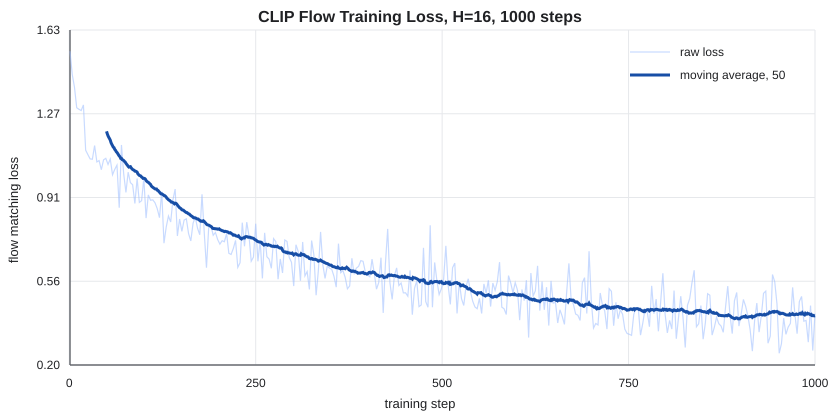

# pi0-lite Flow Action Decoder

This package provides a LeRobot-style custom policy plugin centered on a conditional flow matching action decoder for continuous action chunks.

The current module expects a precomputed conditioning vector in `batch["observation.cond"]` and trains on raw action chunks in `batch["action"]`.

## Vision-Language Condition Input

This policy does not directly consume raw images, text strings, token ids, or
vision-language token sequences. Instead, it expects a precomputed fused
vision-language conditioning vector for each batch item.

The default condition key and shape are:

```python
batch["observation.cond"]  # torch.Tensor, shape: (B, cond_dim)
```

The default configuration uses `cond_dim = 256`, so the default condition tensor
shape is:

```python
batch["observation.cond"].shape == (B, 256)
```

The fallback key `batch["cond"]` is also accepted. During training, the batch
must also include action chunks:

```python
batch = {
    "observation.cond": cond.float(),       # (B, 256) by default
    "action": actions.float(),              # (B, horizon, action_dim)
    "action_is_pad": pad_mask.bool(),       # optional, (B, horizon)
}
```

With the default policy config, actions have shape `(B, 16, 7)`. At inference
time, only the condition vector is required:

```python
batch = {
    "observation.cond": cond.float(),  # (B, 256) by default
}

action = policy.select_action(batch)   # (B, action_dim)
```

If the upstream vision-language encoder outputs a single embedding with a
different width, either set `config.cond_dim` to that width or add a projection
layer before passing the embedding to the policy:

```python
cond = projector(vl_embedding)  # (B, 256)
batch["observation.cond"] = cond
```

If the upstream encoder outputs a token sequence such as `(B, N, D)`, pool or
select a representative token first, then optionally project it to `cond_dim`:

```python
pooled = vl_tokens.mean(dim=1)  # (B, D)
cond = projector(pooled)        # (B, 256)
```

## Representation Encoder

This package includes a lightweight upstream encoder that converts LIBERO-style
image, state, and instruction inputs into the condition key expected by the flow
decoder:

```python
from lerobot_policy_pi0_lite_flow.representation_encoder import (
    RepresentationEncoder,
    RepresentationEncoderConfig,
)

encoder = RepresentationEncoder(RepresentationEncoderConfig(cond_dim=256, num_views=2))
batch = {
    "images": images,              # (B, V, C, H, W)
    "state": state,                # (B, 8) for LIBERO
    "instruction": instructions,   # list[str]
}
batch = encoder.add_condition_to_batch(batch)
batch["observation.cond"].shape == (B, 256)
```

The current encoder path is:

```text
observation.images.image  -> frozen CLIP image encoder -> z_img1
observation.images.image2 -> frozen CLIP image encoder -> z_img2
task                      -> frozen CLIP text encoder  -> z_text
observation.state         -> state MLP                 -> z_state

concat/project/fuse(z_img1, z_img2, z_text, z_state) -> observation.cond
```

For `HuggingFaceVLA/libero`, the inspected sample fields are:

| Field | Shape / type |
| --- | --- |
| `observation.images.image` | `(3, 256, 256)`, `float32` |
| `observation.images.image2` | `(3, 256, 256)`, `float32` |
| `observation.state` | `(8,)`, `float32` |
| `task` | `str` |
| `action` | `(7,)`, `float32` |

`LIBEROActionChunkDataset` wraps these frame-level samples and builds future
action chunks without crossing episode boundaries:

```python
{
    "images": ...,        # (B, 2, 3, 256, 256)
    "state": ...,         # (B, 8)
    "instruction": ...,   # list[str]
    "action": ...,        # (B, horizon, 7)
    "action_is_pad": ..., # (B, horizon)
}
```

For a CLIP-backed smoke test, run:

```powershell
python scripts\smoke_clip_encoder.py
```

For a minimal custom training loop on LIBERO action chunks, run a short mock
encoder smoke test first:

```powershell
python scripts\train_flow_custom.py --steps 3 --max-samples 16 --batch-size 2
```

Add `--use-clip` to train the fusion layers and decoder with frozen CLIP image
and text features. The training script writes `args.json`, `metrics.csv`, and
checkpoints under `runs/pi0_lite_flow/<run-name>/` by default:

```powershell
python scripts\train_flow_custom.py `
  --use-clip `
  --steps 1000 `
  --max-samples 5000 `
  --batch-size 8 `
  --lr 1e-4 `
  --save-every 250 `
  --run-name clip_flow_h16_smoke
```

Convenience launch scripts are also provided:

```powershell
.\scripts\train_clip_debug.ps1
.\scripts\train_clip_1k.ps1
```

If PowerShell blocks local scripts, use:

```powershell
powershell -ExecutionPolicy Bypass -File .\scripts\train_clip_debug.ps1
```

If `python` is not on PATH, set the `PYTHON` environment variable first:

```powershell
$env:PYTHON="C:\Users\admin\.conda\envs\ece228_pi0_py312\python.exe"
.\scripts\train_clip_debug.ps1
```

From Git Bash or a Unix-like shell:

```bash
bash scripts/train_clip_debug.sh
bash scripts/train_clip_1k.sh
```

Plot a saved training curve with:

```powershell
python scripts\plot_metrics.py runs\pi0_lite_flow\clip_flow_h16_debug\metrics.csv
```

Run offline validation on held-out LIBERO samples with:

```powershell
python scripts\eval_flow_custom.py `
  runs\pi0_lite_flow\clip_flow_h16_1k\checkpoint_final.pt `
  --num-samples 512 `
  --batch-size 8 `
  --output runs\pi0_lite_flow\clip_flow_h16_1k\eval.csv
```

## Current Encoder Results

The first 1000-step CLIP run used:

```text
dataset: HuggingFaceVLA/libero
train samples: first 5000 frame indices
validation samples: indices 5000-5511
horizon: 16
batch size: 8
condition dimension: 256
GPU: NVIDIA GeForce RTX 5060 Ti
```

Training loss decreased substantially:

| Metric | Value |
| --- | ---: |
| first-step loss | 1.5355 |
| final-step loss | 0.4177 |
| minimum loss | 0.2489 at step 952 |
| average first 100 steps | 1.0942 |
| average last 100 steps | 0.4168 |



Held-out offline validation on 512 samples:

| Metric | Value |
| --- | ---: |
| action MSE | 0.2633 |
| action L1 | 0.3686 |
| predicted action smoothness | 1.0836 |
| latency per sample | 0.0048 s |

These numbers show that the representation encoder, action chunk dataset, and
flow decoder training loop are functional. They are not yet a final comparison
against BC or autoregressive-token baselines.

## Environment

```powershell
conda create -n ece228-pi0lite python=3.12
conda activate ece228-pi0lite
pip install -e ".[dev,encoder]"
pytest
```

For local core checks before LeRobot is installed, run:

```powershell
$env:PYTHONPATH="src"
pytest
```

## Docker Training

See [`docs/server_training.md`](docs/server_training.md) for the complete Ubuntu
GPU server setup.

The Linux GPU container persists checkpoints under `runs/` and Hugging Face
downloads under `~/.cache/huggingface` on the host. Install Docker with the
NVIDIA Container Toolkit, then run:

```bash
bash scripts/docker_build.sh
bash scripts/docker_train.sh
```

Build with the optional Linux-only LIBERO simulator dependencies when preparing
the same image for future headless rollouts:

```bash
INSTALL_LIBERO=1 bash scripts/docker_build.sh
```

The Docker launcher defaults to all available LIBERO samples. Override its
environment variables for a short smoke run or a longer experiment:

```bash
STEPS=3 MAX_SAMPLES=16 BATCH_SIZE=2 RUN_NAME=smoke bash scripts/docker_train.sh
STEPS=100000 BATCH_SIZE=8 RUN_NAME=clip_flow_full bash scripts/docker_train.sh
```

Read the dataset metadata without downloading the full video dataset:

```bash
python scripts/inspect_libero_metadata.py
python scripts/inspect_libero_metadata.py --list-tasks
```

Train one shared model on a selected subset of LIBERO tasks:

```bash
STEPS=10000 RUN_NAME=tasks_0_1_2 \
  bash scripts/docker_train.sh --task-indices 0 1 2
```
